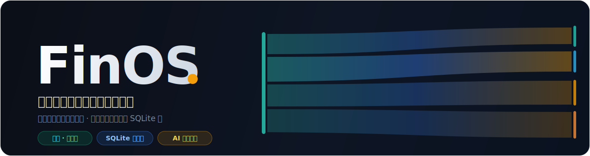
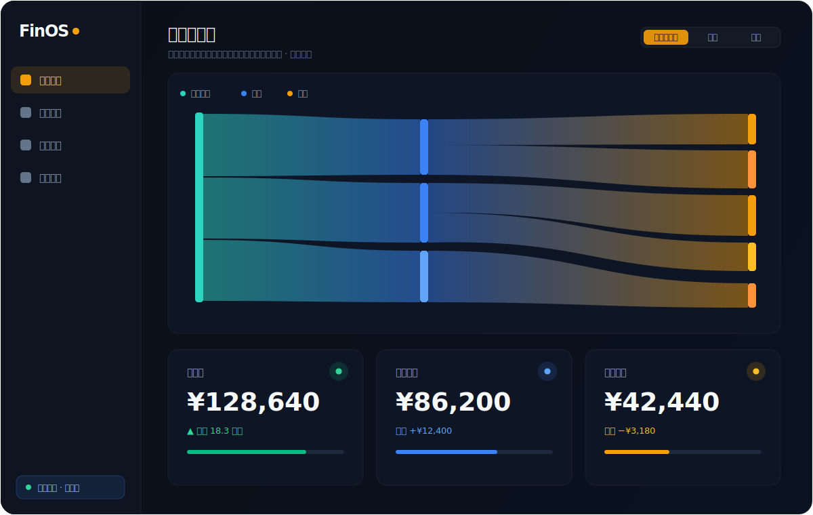

<div align="center">



<br/>


**记生活账，也记经营账。数据只在你自己的机器上 —— 无云、无追踪、无订阅。**

[⚡ 快捷安装](#-快捷安装) · [✨ 功能](#-功能一览) · [🚀 部署](#-部署) · [🤖 让 AI 记账](#-让-ai-帮你记账) · [📖 文档](#-文档)

</div>

---

## ⚡ 快捷安装

把这一行复制给你的编码 AI（**Claude Code / Cursor / OpenClaw** …），或直接丢进终端 —— 它会自动把 FinOS 的 **AI 记账员**技能装好：

```bash
npx -y skills add zhaozimin/FinOS -g --all
```

> 装好后，你的 AI 就听得懂「中午吃麦当劳花了 38」并直接写进账本。
> 想让它真正落库，还需要本机跑起 FinOS 服务 —— 见下方 **一句话部署**。

### 一句话部署服务端

把仓库根目录的 **[`AGENT_DEPLOY_PROMPT.md`](./AGENT_DEPLOY_PROMPT.md)** 整段贴给同一个 AI，它会替你 `clone → 装依赖 → 生成 token → 起服务 → 给你带密钥的网址`。你不用懂命令，照它最后给的网址打开浏览器即可。

想手动来？跳到 [🚀 部署](#-部署)。

<div align="center">
<br/>

<br/>
<sub>▲ 全局资金流 · 净资产与账户总览（示意数据，你的真实数据只在本机）</sub>
</div>

---

## ✨ 功能一览

| 类别 | 功能 |
|---|---|
| **基础** | 多账户管理（资产 / 负债 / 信用卡额度）· 净资产 KPI · 收支流水 · Excel 导出 · 71 套主题 |
| **个人理财** | 月度预算 · 储蓄目标圆环 · 阈值警戒同心圆（绿 / 黄 / 红三档）· 现金流 30/60/90 天预测 · 月度订阅总览 · 多币种自动汇率 |
| **创业经营** | 客户 / 项目 / 对手方名册 · 项目预算双柱（实际 vs 预算）· 项目 P&L 抽屉 · 发票追踪（缺发票徽章 + 工作台）· 报税 5-sheet Excel 导出 · 税务 KPI |
| **数据流入** | 微信 / 支付宝 / 招行账单 CSV 导入 · 周期账目自动生成（订阅 / 工资 / 房租）· 余额调整审计（"黑洞资金"可追溯） |
| **附件** | 每笔交易可挂收据 / 付款截图 / 发票图（image / PDF ≤ 10 MB）· 可绑定为发票 · **AI 也能把你发的图直接落到附件** |
| **效率** | ⌘K 全局搜索（5 类，方向键导航）· 仪表盘 9 widget 拖拽自定义 · 本地保存布局 |
| **AI 接入** | 一份 OpenAPI 风格工具描述 + [SKILL.md](./skills/ai-bookkeeper/SKILL.md)，让任意 LLM agent 帮你记账、附收据 |

<sub>完整图文功能手册：本地打开 [`docs/guides/features-guide.html`](./docs/guides/features-guide.html)。</sub>

---

## 🧱 它是怎么搭的

```
┌──────────────┐   HTTP + Bearer Token   ┌───────────────────────────┐
│  浏览器 / PWA  │ ◀─────────────────────▶ │  finance_node_server.py    │
│  React 19 面板 │                         │  Python 标准库 · 单文件后端 │
└──────────────┘                         │            │               │
        ▲                                │            ▼               │
        │  同一套 HTTP API                 │   SQLite（你的全部数据）     │
        ▼                                └───────────────────────────┘
┌──────────────┐   同一套工具 / SKILL.md
│  AI 记账员     │ ─────────────────────────▶ （Claude / GPT / OpenClaw …）
└──────────────┘
```

- **本地优先**：所有数据只在本机一个 SQLite 文件里，无云、无外部依赖、无追踪。
- **单一真源**：网页、iPhone、AI 记账员共用同一套本地 HTTP API。
- **零构建即用**：仓库自带预构建前端，普通用户开箱即跑，不需要 Node。

---

## 🚀 部署

> 懒人法见上方 [一句话部署](#一句话部署服务端)。下面是手动 5 步。

### 1. 系统要求

- **macOS / Linux**（Windows WSL 也行）
- **Python ≥ 3.9**（仅用标准库 + `openpyxl`）
- **Node ≥ 20**（仅在你想改前端 / 重新构建时需要）
- 50 MB 磁盘 + 一个 `31889` 端口

### 2. 克隆与配置

```bash
git clone https://github.com/zhaozimin/FinOS.git
cd FinOS

pip3 install openpyxl                                   # 唯一的 Python 依赖
cp server/runtime/config.json.example server/runtime/config.json

# 生成一串强随机 token，填进 config.json 的 accessToken
python3 -c "import secrets; print(secrets.token_urlsafe(32))"
```

### 3. 启动

```bash
cd server && python3 finance_node_server.py
```

看到 `Finance Node running on http://0.0.0.0:31889` 即成功。

### 4. 打开浏览器

```
http://127.0.0.1:31889/dashboard/?token=<你刚才设的 token>
```

首次带 `?token=` 打开会自动写进 localStorage，之后直接访问 `/dashboard/` 即可。

### 5. 开始用

进入「财务设置」→ 改 / 删默认账户、加你自己的（微信 / 招行卡 / 信用卡 / 现金…）→ 给每张账户填「当前余额」→ 到「资金流水 → 新增交易」开始记账。

---

## 🎛️ 启动 / 停止 / 状态

`server/` 下自带脚本：

```bash
cd server
python3 finance_node_server.py     # 前台（看日志，Ctrl-C 停）
bash install_launch_agent.sh       # 后台 launchd 开机自启（macOS）
bash status_finance_node.sh        # 状态
bash stop_finance_node.sh          # 停止
bash view_finance_node.sh          # 打印连接信息（地址 + 密钥）
```

---

## 🤖 让 AI 帮你记账

FinOS 的功能全部通过本地 HTTP API 暴露，任何能调 HTTP 的 LLM agent 都能记账、附收据。

**最快**：上方 [⚡ 快捷安装](#-快捷安装) 一行命令把技能装进你的编码 AI。

**手动接入**：

1. 复制工具描述模板并填上你的 `baseUrl` / `token`：
   ```bash
   cp server/runtime/openclaw_finance_tools.json.example \
      server/runtime/openclaw_finance_tools.json
   ```
2. 把 [`skills/ai-bookkeeper/SKILL.md`](./skills/ai-bookkeeper/SKILL.md) 整段贴进 Claude Project / GPT Custom Instructions / OpenClaw prompt。
3. 说一句「中午吃麦当劳花了 38」，AI 就会自动调 `POST /v1/transactions`。

**发图即附**：给 AI 甩一张收据 / 付款截图，它建好交易后会用 `finance_upload_attachment` 把图落到这笔交易的附件里（还能绑定为发票）。细节见 SKILL.md 第十一节与 [`docs/openclaw-integration.md`](./docs/openclaw-integration.md)。

---

## 🌐 远程访问（可选 · 推荐 Tailscale）

把家里 / 公司的 Mac 当后端，手机随时访问：

1. 所有设备装 [Tailscale](https://tailscale.com/download)，登录同一账号（免费档够用）
2. 在跑 FinOS 的 Mac 上：`tailscale status | head -1` 拿到你的 hostname
3. 手机访问 `http://你的-mac.tailxxxx.ts.net:31889/dashboard/?token=<token>`

其他方案：Cloudflare Tunnel（`cloudflared tunnel --url http://127.0.0.1:31889`）、frp / ngrok。**别裸暴露公网** —— token 没有速率限制。详见 [`docs/tailscale-setup.md`](./docs/tailscale-setup.md)。

---

## 🔧 重新构建前端（仅在你改了 React 源码时）

```bash
cd server/web-dashboard
npm install        # 首次或加依赖时
npm run build
rm -rf ../web && cp -R dist ../web
```

`server/web/` 已预构建，**普通用户无需这一步**。

---

## 📖 文档

| 文档 | 内容 |
|---|---|
| [`AGENT_DEPLOY_PROMPT.md`](./AGENT_DEPLOY_PROMPT.md) | 交给编码 Agent 的一键本地部署提示词 |
| [`docs/api.md`](./docs/api.md) | 后端 HTTP API 完整说明 |
| [`docs/ai-recording.md`](./docs/ai-recording.md) | AI 记账字段口径与示例 payload |
| [`docs/openclaw-integration.md`](./docs/openclaw-integration.md) | OpenClaw / LLM Agent 接入 3 步 + 附件流程 |
| [`docs/tailscale-setup.md`](./docs/tailscale-setup.md) | Tailscale 远程访问详解 |
| [`skills/ai-bookkeeper/SKILL.md`](./skills/ai-bookkeeper/SKILL.md) | 给 AI 用的完整记账 skill |
| [`docs/guides/features-guide.html`](./docs/guides/features-guide.html) | 给最终用户看的图文功能手册 |

---

## 📁 目录结构

```
FinOS/
├── README.md
├── AGENT_DEPLOY_PROMPT.md             # 交给编码 agent 的一键部署提示词
├── assets/                            # README 配图（hero / 仪表盘预览）
├── server/
│   ├── finance_node_server.py         # 后端核心（Python 标准库）
│   ├── runtime/
│   │   ├── config.json.example        # 复制为 config.json 后改 token
│   │   ├── openclaw_finance_tools.json.example
│   │   └── attachments/               # 交易附件（发票 / 收据），git 忽略
│   ├── web/                           # 预构建前端（开箱即跑）
│   ├── web-dashboard/                 # React 19 + Vite 源码
│   └── *.sh                           # 启动 / 状态 / 停止脚本
├── docs/                              # API / AI 记账 / 集成 / 远程访问
└── skills/ai-bookkeeper/SKILL.md      # 给 AI 用的记账 skill
```

---

## 🛠️ 故障排查

| 现象 | 对策 |
|---|---|
| 启动报 `Missing config.json` | `cp server/runtime/config.json.example server/runtime/config.json` |
| 启动报 `openpyxl is required` | `pip3 install openpyxl` |
| 浏览器打不开 dashboard | 先 `curl http://127.0.0.1:31889/v1/health` 确认后端起来 |
| 401 Unauthorized | URL 加 `?token=<你的 token>`，或清 localStorage 的 `finance-node-token` 重输 |
| 端口 31889 被占用 | 改 `runtime/config.json` 的 `port`，或 `lsof -tiTCP:31889 \| xargs kill` |
| 想清空数据重来 | `bash server/reset_finance_node_data.sh`（先备份再清空） |
| 升级后功能没出现 | 浏览器硬刷新 `Cmd+Shift+R`（Service Worker 缓存了旧 JS） |

---

## 🔒 安全建议

1. **`accessToken` 一定要改** —— 模板里的占位符等同没设密码。
2. **绝不把 `runtime/config.json` / `finance.sqlite3` 提交进任何公开 git**（`.gitignore` 已排除）。
3. **别裸暴露公网** —— Bearer token 无速率限制，泄露即可遍历交易。走 Tailscale / Cloudflare Tunnel。
4. **定期备份 `runtime/finance.sqlite3`** —— 脚本会在重大迁移时自动建 `.before-*` 备份，日常自己 `cp` 一下也无害。

---

## 📜 License

MIT —— 见 [LICENSE](./LICENSE)。

## 🙏 致谢

由 [Claude Code](https://claude.com/code) 协作开发。从一个生产数据库的 reskin 起步，按 4 个 Phase（基建 / 日常增强 / 创业者业务 / 全局视图）逐步 ship。想扩展功能 / 提需求 / 报 bug → [GitHub Issues](https://github.com/zhaozimin/FinOS/issues)。
